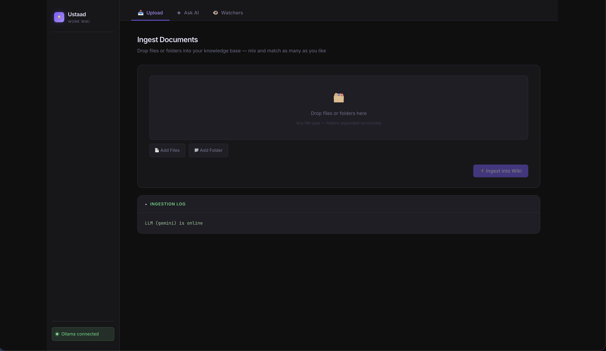

# Ustaad

> A self-hosted, LLM-powered personal wiki engine.


Drop in raw documents, chat transcripts, or any text source — Ustaad ingests them, synthesizes the knowledge into a structured Obsidian-compatible wiki, and lets you query it in natural language.

---

## How It Works

Ustaad follows a strict **living graph** model defined in `wiki/schema-work.md`:

1. **Ingest** — Upload one or more source files (Markdown, PDF, text). The LLM reads the current wiki state and deeply integrates the new source: creating or updating topic pages, ADRs, code snippets, and entity pages, then updating `index.md` and appending to `log.md`.
2. **Query** — Ask a question in natural language. The backend loads the entire wiki as context and streams the LLM's answer back via SSE.
3. **Lint** — Run a health check (manual or nightly at 02:00). The LLM finds orphan pages, flags contradictions with `⚠️ [NEEDS_REVIEW]`, and ensures every code block has a language tag and usage context.
4. **Watch** — Register local folders. The service polls them on a configurable interval and auto-ingests any new or modified files.

---

## Stack

| Layer | Technology |
|---|---|
| Backend | Spring Boot 3, Spring AI |
| LLM providers | Google Gemini (default) · Ollama (local) |
| Templating | Thymeleaf |
| Wiki format | Obsidian-flavoured Markdown |
| Document parsing | Apache Tika, Spring AI PDF reader |

---

## LLM Provider Support

| Provider | Status | `WIKI_LLM_PROVIDER` value | Notes |
|---|---|---|---|
| **Google Gemini** | ✅ Integrated | `gemini` | Default provider |
| **Ollama (local)** | ✅ Integrated | `ollama` | Any model served by Ollama |
| **OpenAI** | 🔲 Planned | — | GPT-4o, o3, etc. |
| **Anthropic Claude** | 🔲 Planned | — | Claude Sonnet / Opus |
| **xAI Grok** | 🔲 Planned | — | Grok-2 and later |
| **Mistral** | 🔲 Planned | — | Mistral Large / Codestral |
| **Cohere** | 🔲 Planned | — | Command R+ |
| **Azure OpenAI** | 🔲 Planned | — | Azure-hosted OpenAI models |

> Contributions adding new providers via Spring AI are welcome — each provider only requires a new `@ConditionalOnProperty` bean in `WikiConfig.java`.

---

## Wiki Structure

```
wiki/
├── schema-work.md      # LLM editor rules (the "constitution")
├── index.md            # Master catalog — auto-maintained by LLM
├── log.md              # Append-only ingestion + lint history
├── topics/             # High-level concepts and system domains
├── entities/           # People, projects, external APIs, databases
├── adrs/               # Architecture Decision Records
├── infrastructure/     # Docker, server config, deployment notes
├── code-snippets/      # Runnable patterns with context
└── performance/        # Load tests, query plans, optimization metrics
sources/                # Raw immutable copies of every ingested file
```

Every wiki page carries mandatory YAML frontmatter:

```yaml
---
tags: []
date_created: YYYY-MM-DD
last_updated: YYYY-MM-DD
status: draft | active | archived
---
```

---

## Deployment

### Docker Compose (recommended)

**Prerequisites:** Docker, Docker Compose v2

Edit `docker-compose.yml` and set the two volume paths and your API key:

```yaml
volumes:
  - /absolute/path/to/your/wiki:/wiki      # ← your wiki directory
  - /absolute/path/to/your/sources:/sources # ← your sources directory

environment:
  SPRING_AI_GOOGLE_GENAI_API_KEY: your-gemini-api-key-here
```

Then start the stack:

```bash
docker compose up -d
```

The UI is available at `http://localhost:8080`.

**Mounts and settings to configure in `docker-compose.yml`:**

| Setting | Description |
|---|---|
| Volume: host wiki path | Absolute host path bind-mounted to `/wiki` |
| Volume: host sources path | Absolute host path bind-mounted to `/sources` |
| `SPRING_AI_GOOGLE_GENAI_API_KEY` | Google Gemini API key |
| `WIKI_LLM_PROVIDER` | `gemini` (default) or `ollama` |
| `SPRING_AI_OLLAMA_BASE_URL` | Ollama URL (when using Ollama) |
| `SPRING_AI_OLLAMA_CHAT_MODEL` | Ollama model name (when using Ollama) |

---

### Running Locally (without Docker)

**Prerequisites:** Java 21+, Maven 3.9+

```bash
export WIKI_BASE_PATH=/path/to/wiki
export WIKI_SOURCES_PATH=/path/to/sources
export GEMINI_API_KEY=your-key-here   # only needed for Gemini provider

cd backend
mvn spring-boot:run
```

The UI is available at `http://localhost:8080`.

---

## UI



Ustaad ships with a built-in web UI at `http://localhost:8080`. From the UI you can:

- **Upload sources** — Drag-and-drop or select files to ingest into your wiki.
- **Ask questions** — Query your wiki in natural language and get streamed answers.
- **Manage watchers** — Add, enable/disable, and trigger folder watchers that auto-ingest new or modified files from local directories.

No separate frontend setup is required — the UI is served directly by the backend.

---

## API

| Method | Path | Description |
|---|---|---|
| `GET` | `/` | Home — shows LLM provider health status |
| `POST` | `/ingest` | Upload one or more files for ingestion |
| `POST` | `/query` | Stream a natural-language query (SSE response) |
| `POST` | `/lint` | Trigger a wiki health check |
| `GET` | `/watchers` | List registered folder watchers |
| `POST` | `/watchers` | Add a folder watcher |
| `POST` | `/watchers/{id}/toggle` | Enable / disable a watcher |
| `DELETE` | `/watchers/{id}` | Remove a watcher |
| `POST` | `/watchers/{id}/run` | Trigger an immediate scan |

---

## Folder Watchers

Folder watchers let you point Ustaad at a directory (e.g., an Obsidian vault of source material or a downloads folder) and have it automatically ingest new and modified files.

- Watcher state is persisted to `watchers.json` and `watchers-state.json` so it survives restarts.
- The scheduler checks every 60 seconds whether any enabled watcher is due for a scan based on its configured interval.
- Only files that are new or whose last-modified timestamp has advanced are ingested — unchanged files are skipped.

---

## License

See [LICENSE](LICENSE).
